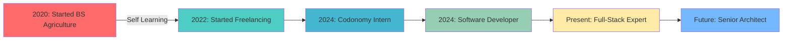

# 


<!-- Animated Title with Rainbow Effect and Custom Font -->
<div align="center">
  <a href="https://git.io/typing-svg">
    
  </a>
</div>

<!-- Animated Social Links -->
<div align="center">
  
  <a href="https://www.linkedin.com/in/muhammad-junaid-35b562232/">
    
  </a>
  <a href="https://github.com/junaidch249">
    
  </a>
  <a href="mailto:junaid.rvx@gmail">
    
  </a>
  
  
  <br><br>
  
  
  
  
</div>

<!-- Animated Divider -->


##  About Me 

<!-- Enhanced Animated About Me Section -->
<div align="center">
  
  <!-- Animated Role Title -->

  
  <!-- Animated Stats Cards -->
  <table>
    <tr>
      <td width="33%" align="center">
        
      </td>
      <td width="67%">
        
  <!-- Beautiful Profile Card with Glassmorphism Effect -->
  <div style="background: linear-gradient(135deg, #667eea 0%, #764ba2 100%); padding: 2px; border-radius: 20px;">
    
  ```yaml
  👨‍💻 MUHAMMAD JUNAID
  ━━━━━━━━━━━━━━━━━━━━━━━━━━━━━━━━━━━━━━━━━━━
  
  🎯 Current Role: Software Developer @ Codonomy
  📍 Location: Islamabad, Pakistan 🇵🇰
  🎓 Education: BS University of Agriculture, Faisalabad (2020-2024)
  ⚡ Experience: 3+ Years of Full-Stack Excellence
  
  🔥 CORE EXPERTISE:
  ┣━━ Frontend Mastery ━━━━━━━━━━━━━━━━━━━━━━━
  ┃   ► React.js | Next.js | JavaScript ES6+
  ┃   ► TypeScript | HTML5 | CSS3
  ┃   ► Tailwind CSS | Material-UI | Bootstrap
  ┃
  ┣━━ Backend Excellence ━━━━━━━━━━━━━━━━━━━━━
  ┃   ► .NET Core | Node.js | Express.js
  ┃   ► RESTful APIs | C# | ASP.NET Core
  ┃   ► Microservices Architecture
  ┃
  ┣━━ Database Wizardry ━━━━━━━━━━━━━━━━━━━━━
  ┃   ► Microsoft SQL Server | MongoDB
  ┃   ► Sequelize ORM | Database Optimization
  ┃   ► Complex Query Design
  ┃
  ┗━━ DevOps & Tools ━━━━━━━━━━━━━━━━━━━━━━━━
      ► Git | Azure DevOps | Docker
      ► Kubernetes | CI/CD | Agile/Scrum
      ► Postman | Swagger | Jira
  
  💫 ACHIEVEMENTS UNLOCKED:
  ╔════════════════════════════════════════════╗
  ║ 🚀 15+ Major Projects Delivered            ║
  ║ ⚡ 40% Page Load Speed Improvement         ║
  ║ 💰 80% Manual Processing Time Reduction    ║
  ║ 🏆 99.99% Calculation Accuracy Achieved    ║
  ╚════════════════════════════════════════════╝
  
  🌈 CURRENT MISSION:
  "Crafting scalable solutions that transform
   business challenges into digital opportunities!"
  ```
  
  </div>
      </td>
    </tr>
  </table>
  
  <!-- Animated Info Bubbles -->
  <div align="center">
    
  </div>
  
  <!-- Interactive Stats Display with Animation -->
  <table align="center">
    <tr>
      <td align="center">
        
        <br>
        
      </td>
      <td align="center">
        
        <br>
        
      </td>
      <td align="center">
        
        <br>
        
      </td>
      <td align="center">
        
        <br>
        
      </td>
    </tr>
  </table>
  
  <!-- Animated Personality Traits -->
  <div align="center">
    <h3> My Developer DNA </h3>

  </div>
  
</div>

<!-- Animated Skills Section -->
##  Tech Stack Mastery

<div align="center">

###  Frontend Excellence


###  Backend Mastery  


###  Database & Cloud


###  Tools & DevOps


</div>

<!-- Animated Divider -->


### 🎯 Impact Metrics

<table>
  <tr>
    <td align="center">
      
      <br><b style="font-family: 'Segoe UI', Tahoma, Geneva, Verdana, sans-serif;">Full-Stack Excellence</b>
    </td>
    <td align="center">
      
      <br><b style="font-family: 'Segoe UI', Tahoma, Geneva, Verdana, sans-serif;">Optimization Master</b>
    </td>
    <td align="center">
      
      <br><b style="font-family: 'Segoe UI', Tahoma, Geneva, Verdana, sans-serif;">Automation Expert</b>
    </td>
    <td align="center">
      
      <br><b style="font-family: 'Segoe UI', Tahoma, Geneva, Verdana, sans-serif;">Precision Coding</b>
    </td>
  </tr>
</table>

</div>

##  Featured Projects Showcase

<div align="center">

<!-- Project Cards with Hover Effects -->
<table>
  <tr>
    <td align="center" width="50%">
      <h3 style="font-family: 'Bebas Neue', cursive; font-size: 1.5em;">🌐 Unifaires Platform</h3>
      
      
      
      
      <br><br>
      <i style="font-family: 'Ubuntu', sans-serif;">Multi-language platform with admin portal, real-time chat, payment integration</i>
      <br>
      <b style="font-family: 'Righteous', cursive;">🚀 2024 | Enterprise Solution</b>
    </td>
    <td align="center" width="50%">
      <h3 style="font-family: 'Bebas Neue', cursive; font-size: 1.5em;">🐟 PJFarmersMarket</h3>
      
      
      
      <br><br>
      <i style="font-family: 'Ubuntu', sans-serif;">Seafood e-commerce marketplace connecting fishermen to customers</i>
      <br>
      <b style="font-family: 'Righteous', cursive;">🛒 US Client | E-commerce</b>
    </td>
  </tr>
  <tr>
    <td align="center" width="50%">
      <h3 style="font-family: 'Bebas Neue', cursive; font-size: 1.5em;">🏥 PrecurePM Healthcare</h3>
      
      
      
      <br><br>
      <i style="font-family: 'Ubuntu', sans-serif;">Medical appointment & insurance system with HIPAA compliance</i>
      <br>
      <b style="font-family: 'Righteous', cursive;">🏥 2024 | Healthcare Solution</b>
    </td>
    <td align="center" width="50%">
      <h3 style="font-family: 'Bebas Neue', cursive; font-size: 1.5em;">💼 HoraceMann Insurance</h3>
      
      
      
      <br><br>
      <i style="font-family: 'Ubuntu', sans-serif;">Commission calculation backend with 99.99% accuracy</i>
      <br>
      <b style="font-family: 'Righteous', cursive;">💰 Insurance | Backend System</b>
    </td>
  </tr>
</table>

</div>

<!-- Snake animation -->
<div align="center">
  <h2 style="font-family: 'Bebas Neue', cursive; font-size: 2em;">🐍 Watch My Contributions Snake</h2>
  <picture>
    <source media="(prefers-color-scheme: dark)" srcset="https://raw.githubusercontent.com/platane/snk/output/github-contribution-grid-snake-dark.svg">
    <source media="(prefers-color-scheme: light)" srcset="https://raw.githubusercontent.com/platane/snk/output/github-contribution-grid-snake.svg">
    
  </picture>
</div>

## 🎯 Current Focus & Learning Journey

<div align="center">
  <table>
    <tr>
      <td align="center" width="33%">
        
        <br><b style="font-family: 'Righteous', cursive;">🔭 Currently Working On</b><br>
        <span style="font-family: 'Ubuntu', sans-serif;">Healthcare Applications<br>
        Enterprise Solutions<br>
        Performance Optimization</span>
      </td>
      <td align="center" width="33%">
        
        <br><b style="font-family: 'Righteous', cursive;">🌱 Learning</b><br>
        <span style="font-family: 'Ubuntu', sans-serif;">Advanced React Patterns<br>
        Microservices<br>
        AI Integration</span>
      </td>
      <td align="center" width="33%">
        
        <br><b style="font-family: 'Righteous', cursive;">💡 Interests</b><br>
        <span style="font-family: 'Ubuntu', sans-serif;">Open Source<br>
        European Football ⚽<br>
        Tech Innovation</span>
      </td>
    </tr>
  </table>
</div>

<!-- Professional Timeline -->
## 🚀 Professional Journey Timeline

<div align="center">



</div>

## 💬 Random Dev Quote

<div align="center">
  
</div>

## 🤝 Let's Connect & Collaborate!

<div align="center">
  
  
  
  
  <br><br>
  
  <h3 style="font-family: 'Bebas Neue', cursive; font-size: 1.8em;">💌 Let's Build Something Amazing!</h3>
  
  <div style="font-family: 'Ubuntu', sans-serif; font-size: 1.1em;">
    
  📧 **Email:** junaid.rvx@gmail.com  
  📱 **Phone:** +92-326-1710249  
  📍 **Location:** Islamabad, Pakistan  
  💼 **Open for:** Full-time Opportunities | Freelance Projects | Collaborations
  
  </div>
  
  <br>
  
  <a href="https://linkedin.com/in/muhammad-junaid">
    
  </a>
  <a href="mailto:junaid.rvx@gmail.com">
    
  </a>
  
</div>

<!-- Animated Footer -->


<div align="center">
  
  ###  Thanks for visiting! 
  
  
  
  ⭐️ **From [junaidrvx](https://github.com/junaidrvx) with** 
  
</div>
